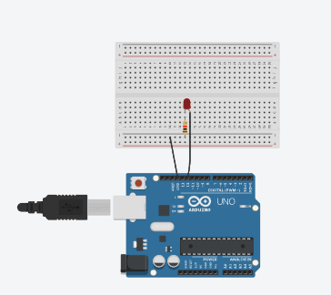
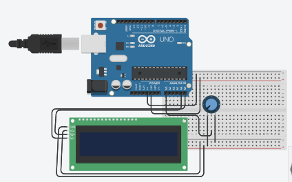

# Modul 3 – Protokol Komunikasi

**Nama:** Ardina Jihan Mariska  
**NIM:** H1H024018  
**Mata Kuliah:** Sistem Mikrokontroler  

## 3.5 Percobaan 3A – Komunikasi Serial UART
### 3.5.4 Pertanyaan Praktikum 3A


### Rangkaian Percobaan 3A

#### 1. Proses dari Input Keyboard hingga LED Menyala/Mati
alur lengkap proses dari input keyboard di komputer hingga LED menyala atau mati:

```
[Pengguna mengetik '1' di Serial Monitor]
            │
            ▼
[Serial Monitor Arduino IDE]
  Karakter '1' dikemas menjadi data UART:
  Start bit → 00110001 (ASCII '1') → Stop bit
            │
            ▼
[Kabel USB / Chip USB-to-Serial (CH340/ATmega16U2)]
  Konversi sinyal USB ke sinyal UART TTL (0V / 5V)
  Data dikirim melalui pin TX komputer → pin RX Arduino
            │
            ▼
[Hardware UART Arduino Uno (pin RX, pin 0)]
  Mendeteksi start bit → sampling setiap bit sesuai baud rate 9600
  Merekonstruksi byte → menyimpan ke buffer penerimaan UART (64 byte)
            │
            ▼
[Program Arduino – fungsi loop() berjalan terus]
  Serial.available() > 0  →  TRUE (ada 1 byte di buffer)
            │
            ▼
  char data = Serial.read()  →  data = '1'
            │
            ▼
  if (data == '1')  →  TRUE
            │
            ▼
  digitalWrite(PIN_LED, HIGH)
  Mikrokontroler mengatur register PORT pin 8 → HIGH
  Pin 8 mengeluarkan tegangan 5V
            │
            ▼
  [Arus mengalir: Pin 8 → resistor 220Ω → LED → GND]
  LED menyala ✓
            │
            ▼
  Serial.println("LED ON")
  Konfirmasi dikirim kembali ke Serial Monitor melalui pin TX Arduino
```

Proses sebaliknya terjadi untuk karakter `'0'`, di mana `digitalWrite(PIN_LED, LOW)` mengatur pin ke 0V sehingga tidak ada arus yang mengalir dan LED padam.

---

#### 2. Mengapa Digunakan `Serial.available()` Sebelum Membaca Data?
`Serial.available()` digunakan untuk memeriksa apakah ada data yang sudah masuk ke buffer penerimaan UART sebelum mencoba membacanya. Ini adalah praktik pemrograman yang wajib karena UART bersifat asinkron — data dari komputer bisa datang kapan saja, tidak selalu sinkron dengan jalannya program di Arduino. `Serial.available()` adalah penjaga (guard) yang memastikan `Serial.read()` hanya dipanggil ketika data benar-benar tersedia, mencegah pembacaan nilai sampah dan mencegah blokade program.

#### 3. – Modifikasi: LED Berkedip (Blink) saat Menerima Input `'2'`
Spesifikasi:
- Input `'1'` → LED menyala terus
- Input `'0'` → LED mati
- Input `'2'` → LED berkedip terus sampai perintah lain diberikan
- Menggunakan `millis()` (bukan `delay()`) agar Serial tetap responsif saat LED berkedip

Kode Modifikasi:
```cpp
#include <Arduino.h>

const int PIN_LED = 8;          // Pin LED sesuai konfigurasi hardware

// State machine: 0 = OFF, 1 = ON, 2 = BLINK
int modeLED = 0;

// Variabel untuk millis() — tracking waktu blink
unsigned long waktuSebelumnya = 0;  // Menyimpan waktu terakhir LED berubah state
const long intervalBlink = 500;     // Interval kedip: 500ms nyala, 500ms mati
bool statusLED = false;             // Status LED saat ini saat blink (true=nyala)

void setup() {
  Serial.begin(9600);
  pinMode(PIN_LED, OUTPUT);
  Serial.println("Perintah: '1'=ON | '0'=OFF | '2'=BLINK");
}

void loop() {

  // ── Bagian 1: Cek input serial ──────────────────────────────
  if (Serial.available() > 0) {        // Cek apakah ada data di buffer
    char data = Serial.read();          // Baca 1 karakter dari buffer

    if (data == '1') {                  // Perintah ON
      modeLED = 1;                      // Set mode ke ON
      digitalWrite(PIN_LED, HIGH);      // Langsung nyalakan LED
      Serial.println("LED ON");

    } else if (data == '0') {           // Perintah OFF
      modeLED = 0;                      // Set mode ke OFF
      digitalWrite(PIN_LED, LOW);       // Langsung matikan LED
      Serial.println("LED OFF");

    } else if (data == '2') {           // Perintah BLINK
      modeLED = 2;                      // Set mode ke BLINK
      waktuSebelumnya = millis();       // Reset timer blink dari sekarang
      statusLED = false;                // Mulai dari kondisi mati
      Serial.println("LED BLINK (ketik '1' atau '0' untuk berhenti)");

    } else if (data != '\n' && data != '\r') {
      Serial.println("Perintah tidak dikenal");   // Input tidak valid
    }
  }

  // ── Bagian 2: Eksekusi mode BLINK non-blocking ───────────────
  if (modeLED == 2) {                             // Hanya jalankan jika mode BLINK aktif
    unsigned long waktuSekarang = millis();        // Ambil waktu saat ini (ms sejak boot)

    // Cek apakah sudah lewat interval (500ms)
    if (waktuSekarang - waktuSebelumnya >= intervalBlink) {
      waktuSebelumnya = waktuSekarang;             // Perbarui referensi waktu

      statusLED = !statusLED;                      // Toggle: balik state LED (true↔false)
      digitalWrite(PIN_LED, statusLED ? HIGH : LOW); // Terapkan ke hardware
    }
    // Jika belum 500ms, tidak ada yang dilakukan → program bebas cek serial lagi
  }

}
```

#### 4. Tentukan apakah menggunakan delay() atau milis()! Jelaskan pengaruhnya terhadap sistem

Pilihan yang digunakan: `millis()`

Penjelasan perbandingan menyeluruh:

| Aspek | `delay()` | `millis()` |
|---|---|---|
| **Cara kerja** | Memblokir eksekusi seluruh program selama N milidetik. CPU sibuk menunggu, tidak melakukan apapun. | Mencatat waktu menggunakan timer hardware, program terus berjalan dan memeriksa selisih waktu secara manual. |
| **Responsivitas serial** | Selama `delay()`, `Serial.available()` tidak dicek → input dari Serial Monitor diabaikan | Serial tetap dicek setiap iterasi `loop()` → perintah baru langsung direspons |
| **Kemampuan multitasking** | Tidak bisa melakukan hal lain selama menunggu | Bisa melakukan banyak hal dalam satu iterasi loop |
| **Kompleksitas kode** | Sederhana, mudah dipahami | Sedikit lebih kompleks, butuh variabel tambahan |
| **Penggunaan ideal** | Inisialisasi, jeda startup, saat tidak ada hal lain yang perlu dilakukan | Semua aplikasi real-time, blink tanpa blocking, debouncing tombol, komunikasi serial |

Ilustrasi perbedaan perilaku:
```
Menggunakan delay(500) untuk blink:

loop()
  ├─ digitalWrite(HIGH)
  ├─ delay(500)  ← BLOKIR 500ms: Serial tidak bisa dibaca!
  ├─ digitalWrite(LOW)
  └─ delay(500)  ← BLOKIR 500ms lagi!

→ Jika pengguna ketik '0' selama delay, input DIABAIKAN
  hingga delay selesai. LED terus blink meski sudah diberi perintah.
─────────────────────────────────────────────
Menggunakan millis() untuk blink:

loop()  (berjalan ratusan kali per detik)
  ├─ Serial.available() → cek input ← SELALU DICEK
  ├─ if (millis() - lastTime >= 500) → toggle LED ← CEK TANPA BLOKIR
  └─ selesai, langsung iterasi berikutnya

→ Setiap iterasi butuh < 1 mikrodetik → Serial Monitor selalu responsif
```

Kesimpulan: Untuk sistem yang membutuhkan LED blink sekaligus tetap menerima perintah serial, `millis()` adalah satu-satunya pilihan yang benar. `delay()` akan membuat sistem tidak responsif terhadap input selama periode penundaan berlangsung.

---

## 3.6 Percobaan 3B – Inter-Integrated Circuit (I2C)
### 3.6.4 Pertanyaan Praktikum 3B
### Rangkaian Percobaan 3B


#### 1. Cara Kerja Komunikasi I2C antara Arduino dan LCD
Cara kerja protokol I2C langkah per langkah:
1. Kondisi START — Arduino (master) menurunkan SDA dari HIGH ke LOW sementara SCL masih HIGH. Ini sinyal bahwa komunikasi akan dimulai.
2. Pengiriman Alamat — Master mengirim 7-bit alamat slave (misal `0x27` = `0100111`) ditambah 1 bit arah (0 = Write, 1 = Read). Total 8 bit.
3. ACK dari Slave — Chip PCF8574 di modul LCD mengenali alamatnya, lalu menarik SDA ke LOW selama satu clock cycle sebagai acknowledge (ACK). Jika tidak ada ACK, master tahu perangkat tidak ada/tidak merespons.
4. Pengiriman Data— Master mengirim byte data (8 bit). Setiap bit dikirim sinkron dengan pulsa clock SCL: bit dibaca saat SCL HIGH. Setelah setiap byte, slave mengirim ACK.
5. Kondisi STOP — Master menaikkan SDA dari LOW ke HIGH sementara SCL HIGH, menandai akhir komunikasi.

Peran PCF8574:
PCF8574 adalah ekspander I/O 8-bit yang berfungsi sebagai jembatan antara protokol I2C (2 kabel) dan antarmuka paralel LCD HD44780 (minimal 6 kabel). PCF8574 menerima 1 byte dari I2C dan mengaktifkan 8 pin output (P0–P7) yang terhubung ke pin-pin kontrol dan data LCD. Hal ini yang memungkinkan LCD dikendalikan hanya dengan 2 kabel (SDA + SCL).

Aliran data saat `lcd.print("ADC: ")`:
```
lcd.print("A")
  → LiquidCrystal_I2C library memecah karakter menjadi 2 nibble (4 bit)
  → Wire.beginTransmission(0x27)
  → Wire.write(nibble_atas | flags)   → I2C → PCF8574 → LCD
  → Wire.write(nibble_bawah | flags)  → I2C → PCF8574 → LCD
  → Wire.endTransmission()
```
---

#### 2. Pin Potensiometer dan Akibat jika Tertukar
**Konfigurasi pin yang benar:**

| Pin Potensiometer | Terhubung ke | Fungsi |
|---|---|---|
| Kaki kiri | GND (0V) | Titik referensi bawah (tegangan minimum) |
| Kaki tengah (wiper) | A0 Arduino | Output tegangan variable yang dibaca ADC |
| Kaki kanan | 5V (VCC) | Titik referensi atas (tegangan maksimum) |

Potensiometer pada dasarnya adalah pembagi tegangan yang bisa diatur. Resistor di dalamnya membentang dari kaki kiri ke kaki kanan, dan kaki tengah (wiper) dapat digeser secara mekanis. Ketika kaki kiri = GND dan kaki kanan = 5V:

- Wiper di posisi paling kiri → tegangan ≈ 0V → ADC ≈ 0
- Wiper di tengah → tegangan ≈ 2.5V → ADC ≈ 511
- Wiper di posisi paling kanan → tegangan ≈ 5V → ADC ≈ 1023

Yang terjadi jika kaki kiri dan kanan TERTUKAR (kiri=5V, kanan=GND):

Perilaku potensiometer menjadi terbalik secara mekanis:
- Wiper di posisi paling kiri → tegangan ≈ 5V → ADC ≈ 1023 (seharusnya 0)
- Wiper di posisi paling kanan → tegangan ≈ 0V → ADC ≈ 0 (seharusnya 1023)

Akibat pada tampilan LCD:
- Saat potensiometer diputar ke kiri → bar menjadi penuh (seharusnya kosong)
- Saat diputar ke kanan → bar menjadi kosong (seharusnya penuh)
- Nilai ADC tetap valid secara elektrik (tidak ada kerusakan), hanya arahnya terbalik

Pertukaran ini tidak merusak hardware, hanya membalikkan arah respons. Jika tujuannya hanya fungsionalitas (bukan arah putar), perilaku tetap benar secara fisik. Namun jika arah putaran penting (misalnya kontrol motor), konfigurasi harus diperbaiki atau dikompensasi di software dengan `map(nilai, 1023, 0, 0, 16)`.

---
#### 3. Modifikasi: Gabungan UART + I2C

Kode Modifikasi (modul3_serialmonitor3.ino):

```cpp
#include <Wire.h>               // Mengimpor library untuk komunikasi I2C
#include <LiquidCrystal_I2C.h>  // Mengimpor library untuk LCD I2C
#include <Arduino.h>            // Library utama Arduino

LiquidCrystal_I2C lcd(0x27, 16, 2);  // Inisialisasi LCD: alamat 0x27, 16 kolom, 2 baris
const int pinPot = A0;               // Pin potensiometer di A0

void setup() {
  Serial.begin(9600);                // Inisialisasi komunikasi serial UART 9600 bps
  lcd.init();                        // Inisialisasi LCD melalui I2C
  lcd.backlight();                   // Nyalakan backlight LCD
}

void loop() {
  int nilai = analogRead(pinPot);             // Baca nilai ADC dari potensiometer (0–1023)

  float volt = nilai * (5.0 / 1023.0);        // Konversi ADC ke tegangan (V): V = ADC × (5/1023)
  int persen = map(nilai, 0, 1023, 0, 100);   // Konversi ADC ke persentase (0–100%)
  int panjangBar = map(nilai, 0, 1023, 0, 16);// Konversi ADC ke panjang bar (0–16 karakter)

  // ── Output UART: Serial Monitor ──────────────────────────────
  Serial.print("ADC: ");
  Serial.print(nilai);               // Tampilkan nilai ADC mentah
  Serial.print(" Volt: ");
  Serial.print(volt, 2);             // Tampilkan tegangan dengan 2 desimal
  Serial.print(" Persen: ");
  Serial.print(persen);              // Tampilkan persentase (integer)
  Serial.println("%");               // Tutup baris dengan simbol % dan newline

  // ── Output I2C: LCD Baris 1 — nilai ADC ──────────────────────
  lcd.setCursor(0, 0);               // Kursor ke kolom 0, baris 0 (baris pertama)
  lcd.print("ADC: ");                // Cetak label
  lcd.print(nilai);                  // Cetak nilai ADC
  lcd.print(" ");                    // Spasi untuk menghapus digit sisa

  // ── Output I2C: LCD Baris 2 — bar level ──────────────────────
  lcd.setCursor(0, 1);               // Kursor ke kolom 0, baris 1 (baris kedua)
  for (int i = 0; i < 16; i++) {     // Iterasi 16 posisi karakter di baris 2
    if (i < panjangBar) {
      lcd.print((char)255);          // Posisi aktif: cetak blok penuh (█)
    } else {
      lcd.print(" ");                // Posisi tidak aktif: cetak spasi (hapus blok lama)
    }
  }

  delay(200);                        // Tunda 200ms: cegah flickering dan baca ADC stabil
}
```
---

#### 4. Tabel Pengamatan ADC

Tabel berikut berisi hasil pengamatan dari Serial Monitor

| ADC | Volt (V) | Persen (%) | 
|:---:|:--------:|:----------:|
| 16  | 0.08 V   | 1%         | 
| 21  | 0.10 V   | 2%         | 
| 49  | 0.24 V   | 4%         | 
| 74  | 0.36 V   | 7%         | 
| 96  | 0.47 V   | 9%         | 

---
